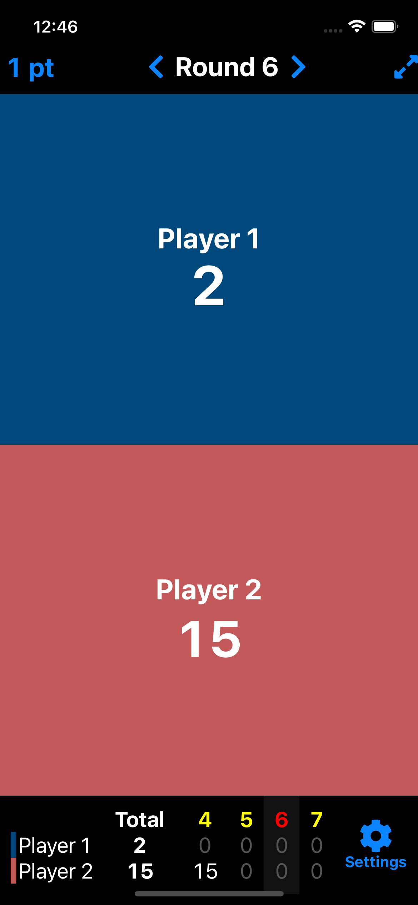
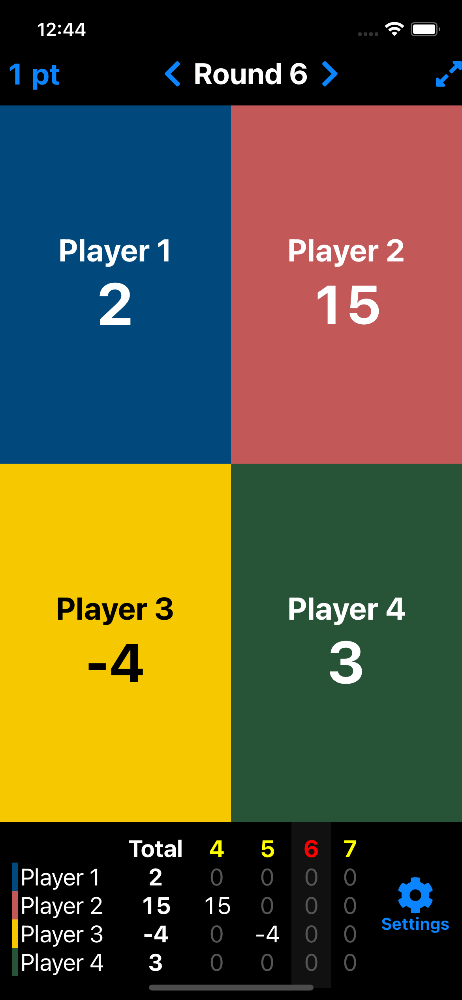
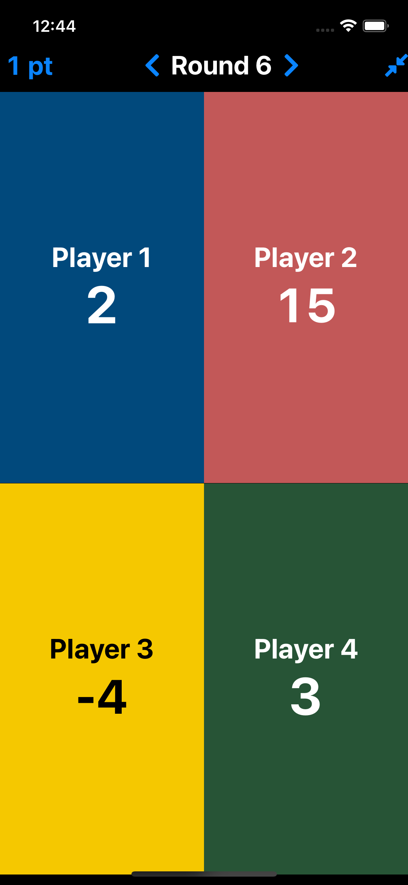
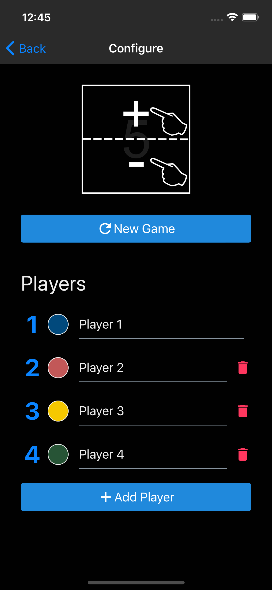
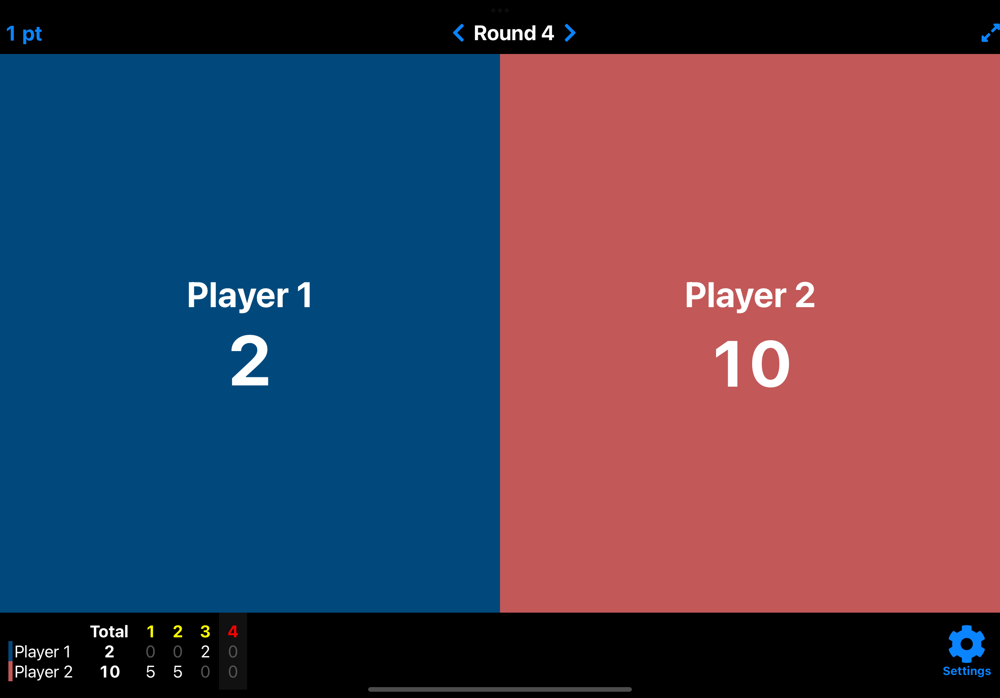
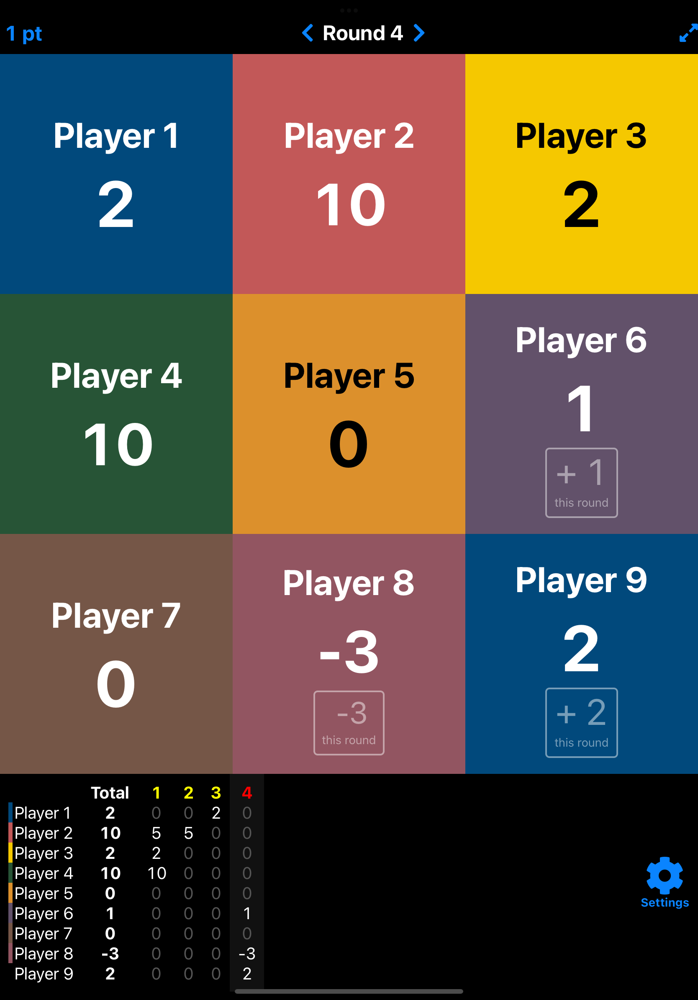
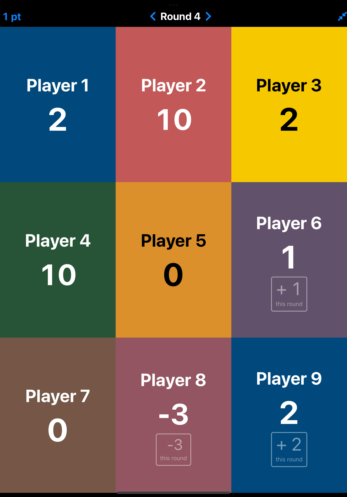
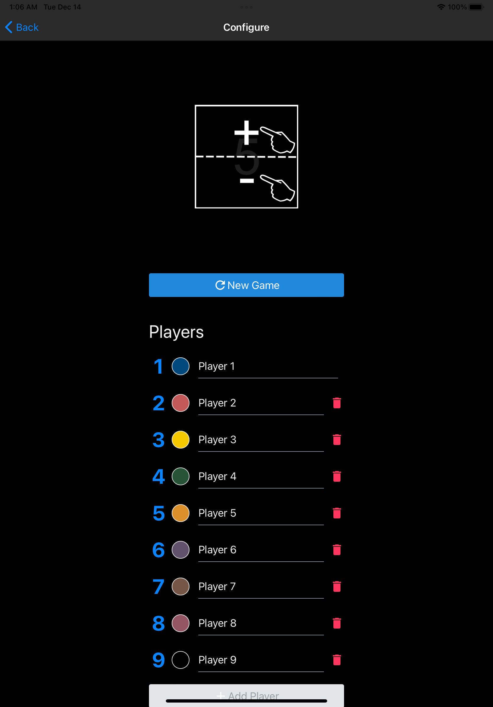

 ScorePad with Rounds
---

An open-source, multi-platform score keeping app with per-round score history.

## Website

https://wyne.github.io/scorepad/
## Download

- [Apple App Store (iPhone, iPad, and M1 Mac)](https://apps.apple.com/us/app/scorepad-with-rounds/id1577906063)
- [Google Play Store (Android phones and tablets)](https://play.google.com/store/apps/details?id=com.wyne.scorepad)
- [Web App](https://wyne.github.io/scorepad-app/)

## Screen Shots
| Device | Two Players                                                           | More Players                                                            | Fullscreen                                                                       | Settings                                                                   |
| ------ | --------------------------------------------------------------------- | ----------------------------------------------------------------------- | -------------------------------------------------------------------------------- | -------------------------------------------------------------------------- |
| Phone  |  |    |    |  |
| Tablet |   |  |  |             |


### Run with Expo Go

```
npx expo start
```

Then use the expo UI to run on iOS, Android, or web.

### Development build for iOS Simulator

Prerequisite: `SENTRY_AUTH_TOKEN` in `.env`

```zsh
npx react-native-clean-project
npx expo prebuild
eas build --profile development-simulator --platform ios
eas build:run -p ios # select expo build from above
npx expo start --dev-client
```

Debug Firebase events by running simulator with `FIRAnalyticsDebugEnabled` flag:

```zsh
xcrun simctl launch "iPhone 8" com.wyne.scorepad.dev -FIRAnalyticsDebugEnabled
```

Debug Firebase Crashlytics by running simulator with `FIRDebugEnabled` flag:

```zsh
xcrun simctl launch "iPhone 14 Pro Max" com.wyne.scorepad.dev -FIRDebugEnabled
```

### Local development build for iOS Device

Prerequisite: `SENTRY_AUTH_TOKEN` in `.env` and be sure it's loaded

```zsh
npx expo prebuild -p ios
eas build --platform ios --profile development --local
```

Debug eas config settings: `eas config --platform=ios --profile=development`

### Preview Build (Standalone)

```zsh
npx expo prebuild -p ios
npx eas-cli build --platform ios --profile preview --local
```

### Remote Build

```zsh
npx expo-doctor
npx expo prebuild
eas build --platform ios
eas build --platform android
```

### Submit to App Stores

Apple

```zsh
eas submit -p ios
```

Or: `eas submit -p ios --non-interactive`


Android

```zsh
eas submit -p android --changes-not-sent-for-review
```
